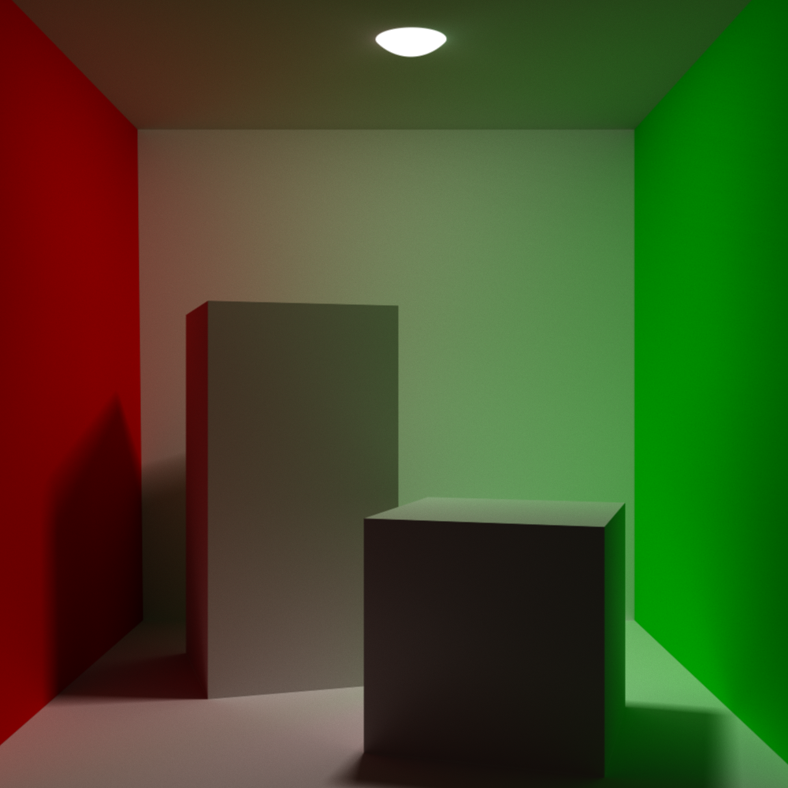
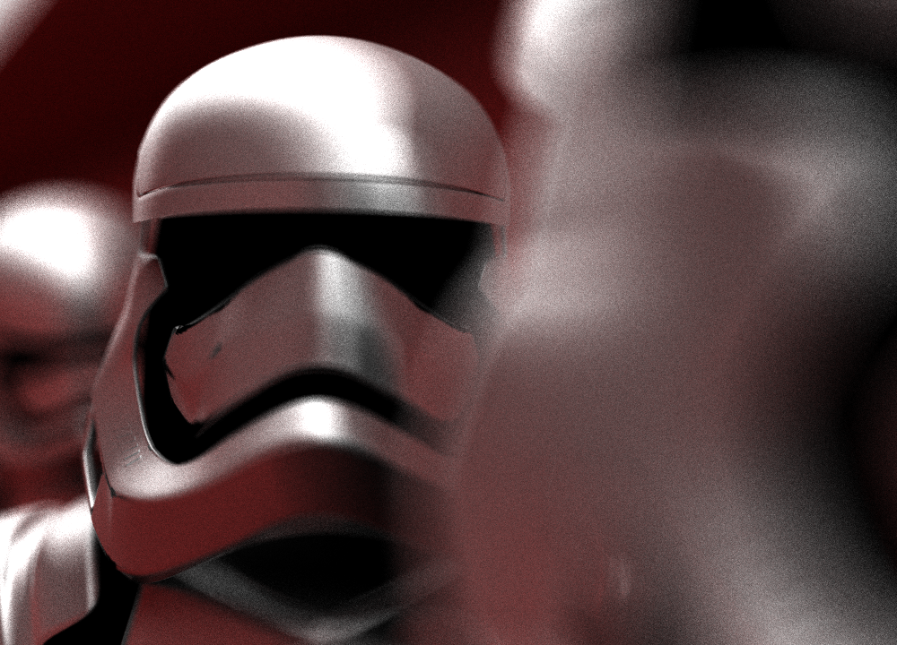

# LiSA Path Tracing Renderer


LiSA is a path tracing rendering engine developped in C++ using CUDA 11 and GLM.

LiSA runs in multiple CUDA threads and uses the Monte-Carlo rendering technique.

You can see some examples of rendered images [here](#Some-images).

## Build and usage

### Linux
You need CUDA to compile this project.

For Ubuntu or Debian distribution run: 
```bash
sudo apt install nvidia-cuda-toolkit
```
For others distributions check [here](https://docs.nvidia.com/cuda/cuda-installation-guide-linux/index.html)

Then:
```bash
cd build
make
./LiSA scene_file.rto nb_passes output_file.ppm [nb_sample=3]
```

### Windows
TODO

## How it works
- The number of passes corresponds to the number of times LiSA will compute the color of each pixel to average it.
- The output file is a [ppm](https://fr.wikipedia.org/wiki/Portable_pixmap) image.
- The number of samples correponds to the number of times a ray can bounce. Default is 3.
- You have to provide a file describing the scene you want LiSA to render. You can find some examples [below](#Scene-file-example) or in the folder ````assets````.
- In the scene file you need one camera, atleast one material and output dimension. See [Limitations](#Limitations) to learn more.

## Scene file
The syntax is quite free: 
- Material names have the same constraints as C/C++ variables.
- You can skip lines or add as many spaces as you want.
- Any text between ```/*``` and ```*/``` is treated as a comment

### Scene file example
````
Material rough_white {
    color = (1, 1, 1)
    roughness = 1
}

Material Red {
    color = (1,0,0)
    roughness = 0.7
}

Material green {
    color = (0,1,0)
    roughness = 1
}

Material light {
    light = true
    color = (1,1,1)
    emit_intensity = 1
}


Mesh {
    obj_file = ../assets/objs/cornell_box/bot.obj
    material = rough_white
}

Mesh {
    obj_file = ../assets/objs/cornell_box/top.obj
    material = rough_white
}

Mesh {
    obj_file = ../assets/objs/cornell_box/back.obj
    material = rough_white
}

Mesh {
    obj_file = ../assets/objs/cornell_box/right.obj
    material = green
}

Mesh {
    obj_file = ../assets/objs/cornell_box/left.obj
    material = Red
}

Mesh {
    obj_file = ../assets/objs/cornell_box/large_box.obj
    material = rough_white
}

Mesh {
    obj_file = ../assets/objs/cornell_box/small_box.obj
    material = rough_white
}


Sphere {
    center = (0, 0.25, -0.05)
    radius = 0.03
    material = light
}

Camera {
    position = (-0.01, 0.015, 0.60)
    look_at = (-0.01, 0.015, 0)
    fov = 40
}

/*Camera {
    position = (-0.01, 0.015, 0.60)
    look_at = (-0.01, 0.015, 0)
    fov = 40
    focal_plane = 0.05
}*/

output_width = 1000
output_heigth = 1000
````

## Features
- Any object can emit light.
- Simple BRDF.
- FOV can be chosen.
- Anti aliasing.
- Focal plane
- Only your GPU memory limits the number of triangles per scene.

## Limitations
There are some limitations to LiSA:
- Only one emitting object per scene (the others will be ignored).
- LiSA is slow.
- The obj file HAS to be composed of triangles

## Some images
In order to use these scenes files, you to be inside the `out/` folder.


````assets/chess_pawn.rto````


````assets/cornell_box.rto````


````assets/cornell_box.rto```` with square light


````assets/spaceship.rto````

model from https://benedikt-bitterli.me/resources/


````assets/stormtrooper.rto````



## TODO list
- ~~Anti aliasing.~~
- ~~Focal plane~~
- Optimize the computation time.
- Add the Disney's BRDF
- Add transparency and refraction.
- Add support for texture.

## Credits
- [GLSL Path tracer](https://github.com/knightcrawler25/GLSL-PathTracer). An amazing renderer. I took a lot of .obj for testing LiSA from here. 
- [Scratchpixel 2.0](https://www.scratchapixel.com/) for their lessons about ray tracing, monte carlo, etc..
## License
[GNU v3](https://choosealicense.com/licenses/gpl-3.0/)
